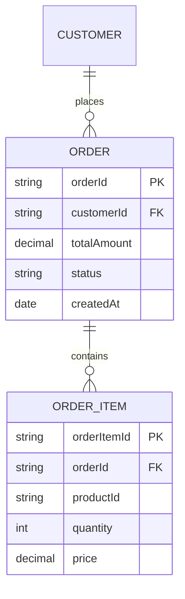
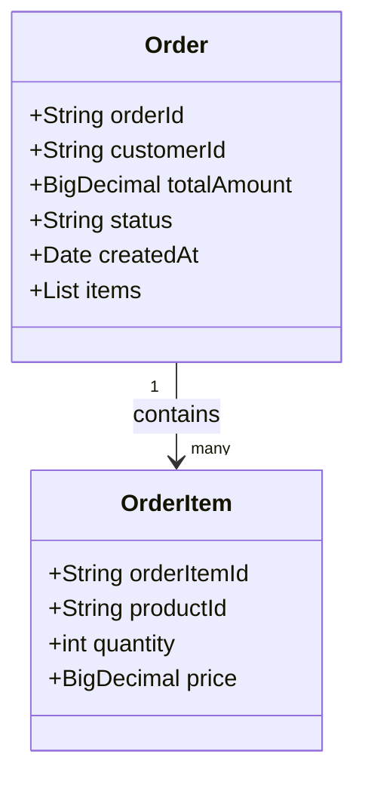
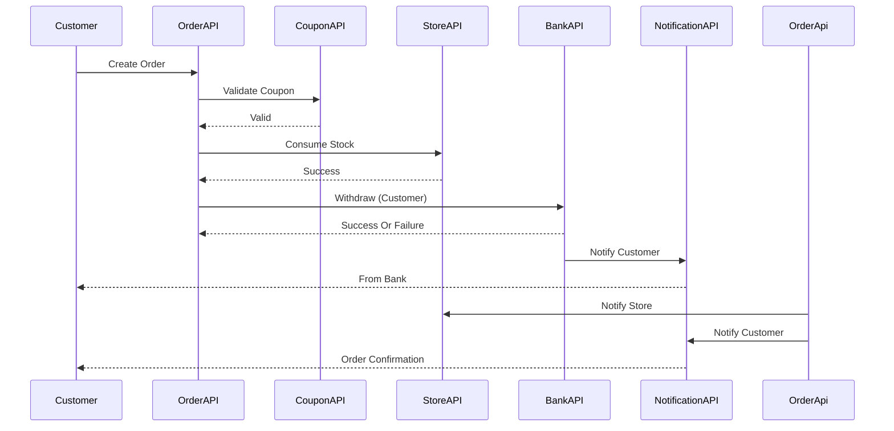

# Order API

## Data Models (Order-API)
### ER Diagram

```mermaid
erDiagram
    CUSTOMER ||--o{ ORDER : places
    ORDER ||--o{ ORDER_ITEM : contains
    ORDER {
        string orderId PK
        string customerId FK
        decimal totalAmount
        string status
        date createdAt
    }
    ORDER_ITEM {
        string orderItemId PK
        string orderId FK
        string productId
        int quantity
        decimal price
    }
```

## Class Diagram

```mermaid
classDiagram
    class Order {
        +String orderId
        +String customerId
        +BigDecimal totalAmount
        +String status
        +Date createdAt
        +List<OrderItem> items
    }

    class OrderItem {
        +String orderItemId
        +String productId
        +int quantity
        +BigDecimal price
    }

    Order "1" --> "many" OrderItem : contains
```

## Key Workflows
### Order Creation Sequence

```mermaid
sequenceDiagram
    participant Customer
    participant OrderAPI
    participant CouponAPI
    participant StoreAPI
    participant BankAPI
    participant NotificationAPI

    Customer->>OrderAPI: Create Order
    OrderAPI->>CouponAPI: Validate Coupon
    CouponAPI-->>OrderAPI: Valid
    OrderAPI->>StoreAPI: Consume Stock
    StoreAPI-->>OrderAPI: Success
    OrderAPI->>BankAPI: Withdraw (Customer)
    BankAPI-->>OrderAPI: Success Or Failure
    BankAPI->>NotificationAPI: Notify Customer
    NotificationAPI-->>Customer: From Bank
    OrderApi->>StoreAPI: Notify Store
    OrderApi->>NotificationAPI: Notify Customer
    NotificationAPI-->>Customer: Order Confirmation
```